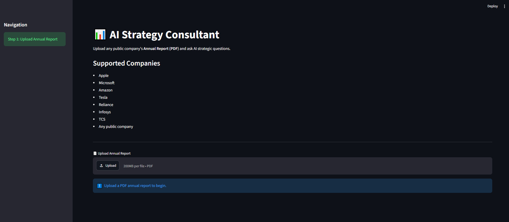
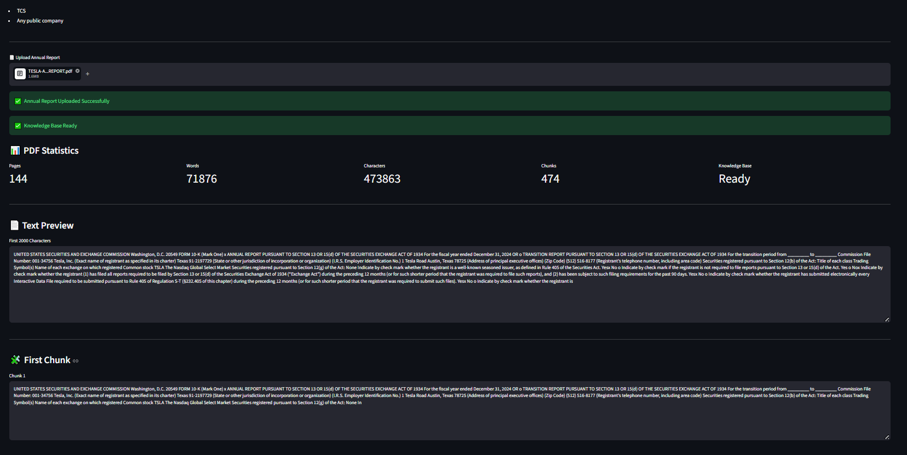
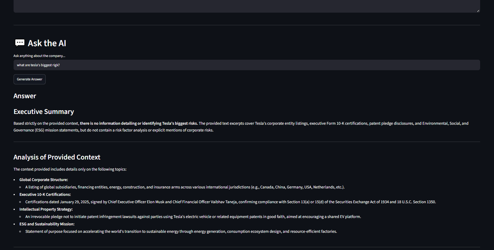

# 🤖 AI Strategy Consultant

An AI-powered business strategy assistant that analyzes corporate annual reports and generates consulting-style insights using **Generative AI, Retrieval-Augmented Generation (RAG), and Large Language Models (LLMs).**

The application helps users quickly understand company performance, identify risks, discover growth opportunities, and generate strategic recommendations from lengthy business documents.

---

## 🚀 Project Overview

Business analysts and consultants spend significant time manually reviewing annual reports to extract meaningful insights.

**AI Strategy Consultant** automates this process by allowing users to upload a company's annual report and receive structured strategic analysis within seconds.

The application transforms unstructured business documents into actionable intelligence using AI-powered document understanding.

---

## 🎯 Key Features

✅ Upload any company annual report PDF
✅ Extract and process large business documents
✅ AI-powered document understanding using RAG architecture
✅ Generate consulting-style strategic insights
✅ Automated SWOT Analysis
✅ Identify key business risks
✅ Discover growth opportunities
✅ Generate executive summaries
✅ Ask questions about the uploaded report using AI

---

## 🧠 How It Works

```
Annual Report PDF
        |
        ↓
PDF Text Extraction
        |
        ↓
Document Chunking
        |
        ↓
Embedding Generation
        |
        ↓
Vector Database Storage
        |
        ↓
Relevant Context Retrieval
        |
        ↓
LLM-Based Strategic Analysis
        |
        ↓
Business Insights & Recommendations
```

---

## 🛠️ Tech Stack

### Programming Language

* Python

### AI & Machine Learning

* Google Gemini API
* Retrieval-Augmented Generation (RAG)
* Large Language Models (LLMs)
* Text Embeddings

### Data Processing

* Pandas
* PyPDF

### Database

* ChromaDB (Vector Database)

### Application Development

* Streamlit

---

## 📌 Application Workflow

1. User uploads a company annual report PDF.
2. The document is extracted and divided into meaningful text chunks.
3. Text embeddings are generated and stored in a vector database.
4. User queries retrieve relevant sections from the document.
5. Gemini AI generates structured strategic insights based on retrieved information.

---

## 📊 Generated Insights

The application provides:

### 🏢 Company Overview

Summarizes the company's business model, operations, and key highlights.

### 🔍 SWOT Analysis

Identifies:

* Strengths
* Weaknesses
* Opportunities
* Threats

### ⚠️ Risk Identification

Highlights major operational, financial, and strategic risks.

### 📈 Growth Opportunities

Suggests potential areas for expansion and improvement.

### 💡 Strategic Recommendations

Provides consultant-style recommendations based on company data.

### 📄 Executive Summary

Creates a concise management-level overview.

---

## 📸 Screenshots

### Home Page



### Document Upload



### AI Strategic Analysis



### AI Question Answering


---

## 🔮 Future Enhancements

* Financial KPI extraction from annual reports
* Automated financial ratio analysis
* Competitor comparison framework
* Multi-company report comparison
* Automated PowerPoint strategy presentations
* Integration with real-time market data

---

## 📂 Project Structure

```
AI-Strategy-Consultant/
│
├── app.py
├── requirements.txt
├── README.md
│
├── utils/
│   ├── pdf_reader.py
│   └── other utilities
│
├── uploads/
│
└── images/
    ├── home.png
    ├── upload.png
    ├── analysis.png
    └── qa.png
```

---

## ⚙️ Installation & Setup

Clone the repository:

```bash
git clone https://github.com/aditree1111/AI-Strategy-Consultant.git
```

Navigate to the project folder:

```bash
cd AI-Strategy-Consultant
```

Create a virtual environment:

```bash
python -m venv venv
```

Activate the environment:

Windows:

```bash
.\venv\Scripts\activate
```

Install dependencies:

```bash
pip install -r requirements.txt
```

Add your API key in `.env`:

```
GEMINI_API_KEY=your_api_key_here
```

Run the application:

```bash
streamlit run app.py
```

---

## 🎓 Skills Demonstrated

* Generative AI Application Development
* Retrieval-Augmented Generation (RAG)
* Natural Language Processing
* Document Intelligence
* Vector Databases
* Data Processing with Python
* Business Strategy Analysis
* AI Product Development

---

## 👩‍💻 Author

**Aditree Bajpai**

B.Sc. Mathematics (Hons.)
University of Delhi

